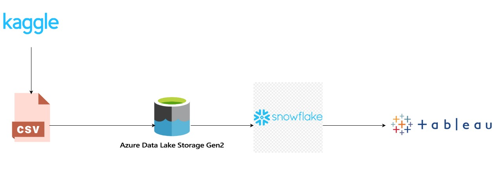

# netflixDataAnalysis-snowFlake-project

# Netflix Data Analysis Project

This project involves analyzing Netflix data to extract valuable insights and visualize them using Tableau. The workflow includes data ingestion, cleaning, transformation, and visualization.

## Objective

To analyze Netflix data by pulling a CSV file from Kaggle, processing it through Snowflake, and visualizing the insights with Tableau.

## Tools Used

- **Kaggle**: Source of Netflix CSV data.
- **Azure Data Lake Storage Gen2 (ADLS Gen2)**: Storage for the raw CSV file.
- **Snowflake**: Data warehousing and processing.
- **Tableau**: Data visualization.

## Solution Architecture

## Key Steps

1. **Data Ingestion**
   - Pull the Netflix CSV file from Kaggle.
   - Store the CSV file in ADLS Gen2.

2. **Snowflake Setup**
   - Create a storage integration in Snowflake.
   - Define the file format and stage in Snowflake.
   - Connect the stage to the CSV file location in ADLS Gen2.

3. **Data Loading**
   - Load the CSV data from the stage into a table named `netflix_raw` in the `netflix_analysis` database.

4. **Data Cleaning**
   - Clean the `netflix_raw` table by removing duplicates and null values.

5. **Data Transformation**
   - Populate dimension tables such as `netflix_cast`, `netflix_country`, `netflix_directors`, `netflix_genre`, etc., from the cleaned raw data.
   - Create a `netflix_processed` table that serves as a fact table, with the other tables acting as dimensions.

6. **Data Analysis**
   - Create SQL queries to extract insights from the data.

7. **Data Visualization**
   - Use Tableau to create visualizations based on the analysis queries.

## Findings

The findings from the data analysis and visualizations are documented in a PowerPoint presentation. You can view the presentation [here](visualization/netflix-dataVisualization.pptx).
